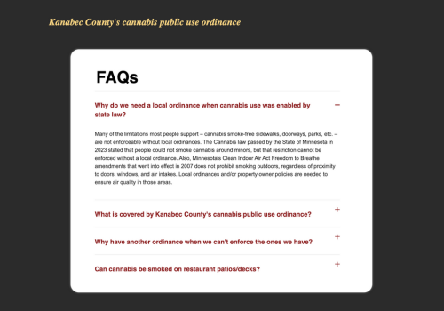

# FAQ Accordion
After first coding an [FAQ with JavaScript for a Frontend Mentor challenge](https://github.com/alison-ah/faq-accordion-main), I rebuilt it without JavaScript and customized the design to align with organization branding.

[View the FAQ Accordion](https://alison-ah.github.io/faq-accordion-portfolio/)
 

## Built with
- Semantic HTML5 markup
- CSS custom properties
- CSS pseudo-classes and pseudo-elements
- Flexbox
- Mobile-first workflow

## Acknowledgments
This is a customization of the [FAQ accordion challenge on Frontend Mentor](https://www.frontendmentor.io/challenges/faq-accordion-wyfFdeBwBz). Frontend Mentor challenges help you improve your coding skills by building realistic projects.

The content reflects real questions from constituents and summarized responses from Kanabec County's Community Health Director, Sheriff, and others.
